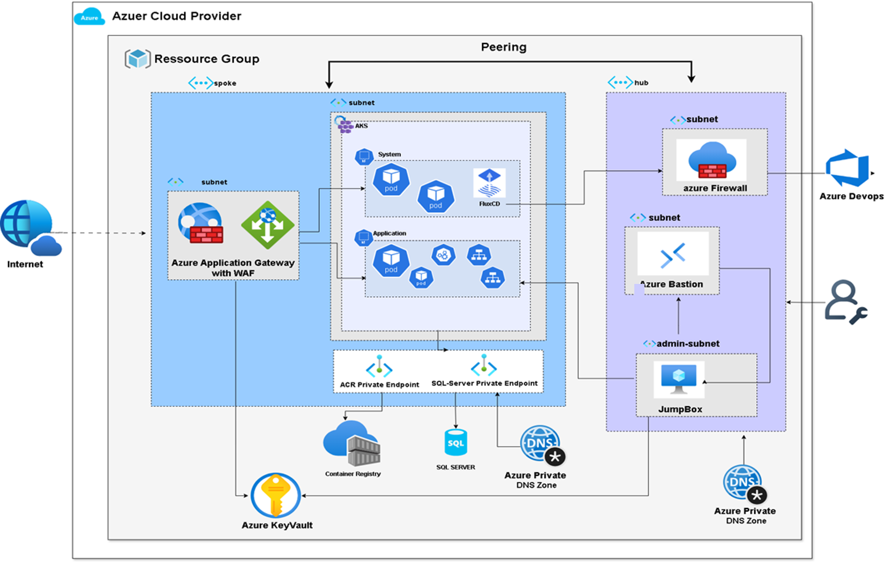

# Terraform Infrastructure for Azure Automation Project

## Overview

This repository contains Terraform configurations to provision and manage Azure infrastructure resources for the Azure Automation project. The infrastructure is modularized for better organization, reuse, and scalability.

---

## Architecture Diagram



---

## Architecture Components

The infrastructure is composed of the following modules:

- **acr/** — Azure Container Registry to store container images securely.
- **aks/** — Azure Kubernetes Service cluster for container orchestration.
- **bastion/** — Azure Bastion host for secure and seamless RDP/SSH access to VMs.
- **firewall/** — Azure Firewall for network security and traffic filtering.
- **gateway/** — Application Gateway for load balancing and web traffic routing.
- **keyvault/** — Azure Key Vault for centralized secrets, keys, and certificates management.
- **network/** — Virtual Network (VNet), Subnets, Network Security Groups (NSGs), and other network components.
- **sql/** — Azure SQL Database for relational data storage.
- **vm/** — Virtual Machines for hosting custom workloads or legacy applications.

---

## Provisioning Details

- Terraform version: `>= 1.5.0`
- Azure Provider version: `>= 3.0`
- Modular design with each component in its own directory.
- Variables are defined in `variables.tf` files within each module.
- State is stored remotely in Azure Blob Storage (recommended for collaboration).

---

## Usage

1. Authenticate to Azure CLI:

    ```bash
    az login
    ```

2. Initialize Terraform:

    ```bash
    terraform init
    ```

3. Review the plan:

    ```bash
    terraform plan
    ```

4. Apply changes:

    ```bash
    terraform apply
    ```

---

## Security Best Practices

- Do **not** hardcode secrets or sensitive data inside Terraform files.
- Use **Azure Key Vault** integration and environment variables to inject secrets.
- Protect Terraform state files by using remote backend with locking and encryption.
